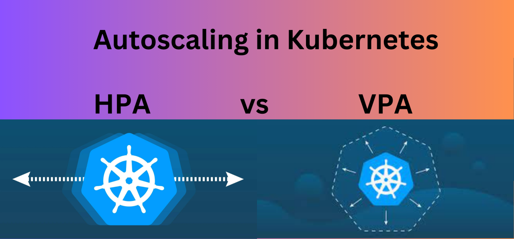
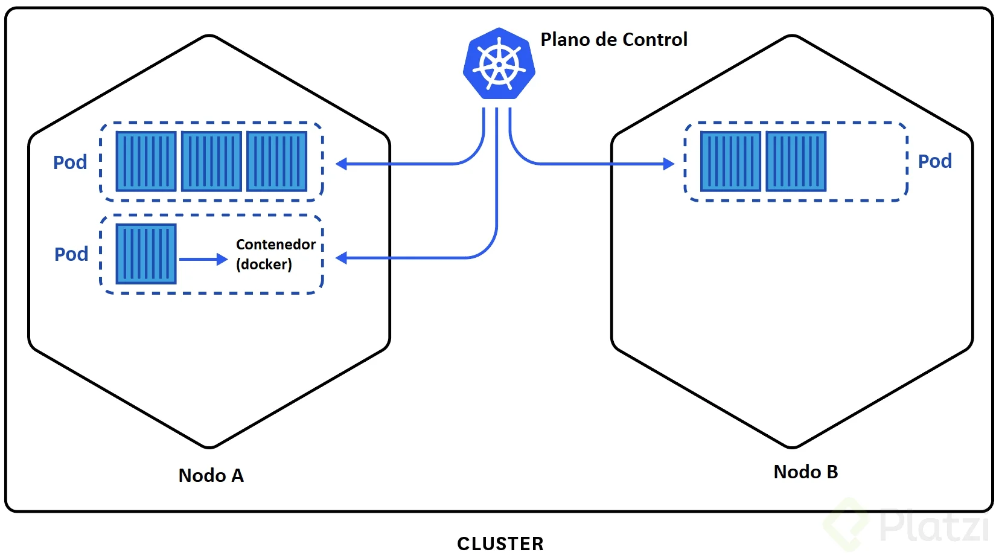

#  ¿Qué es Auto Scaling?

Definición:
Capacidad de ajustar automáticamente recursos computacionales según demanda.

**Tipos en Kubernetes:**

- Horizontal: Añade/elimina pods (nuestro enfoque)
- Vertical: Aumenta/reduce recursos de un pod

Beneficios:
- Optimización de costos
- Alta disponibilidad
- Manejo de carga variable



# ¿Qué es Kubernetes?

Definición:
Sistema de orquestación de contenedores open-source para automatizar despliegues, escalado y gestión de aplicaciones.

**Conceptos clave para el demo:**

- Pods: Unidad mínima de ejecución (1+ contenedores)
- Deployments: Gestionan el ciclo de vida de los pods
- Services: Exponen aplicaciones internamente/externamente
- HPA: Horizontal Pod Autoscaler (autoescalado basado en métricas)



# Flujo del Demo

1. Despliegue inicial: 2 pods con recursos mínimos
2. Prueba de carga: hey genera tráfico HTTP
3. Escalado automático:
    -  HPA detecta >10% uso CPU
    - Crea nuevos pods (hasta 10)
4. Reducción: Al terminar la carga, elimina pods extras

# Demo de Auto Scaling con Kubernetes
Esta demostración muestra cómo configurar Auto Scaling horizontal en Kubernetes usando una aplicación React básica con métricas de CPU y memoria.

"Kubernetes automatiza el despliegue y escalado de aplicaciones. En este demo, configuramos un HPA que monitorea el uso de CPU y automáticamente añade pods cuando la carga supera el 10%, demostrando cómo aplicaciones reactivas pueden manejar tráfico variable sin intervención manual."

## Prerrequisitos
- Docker Desktop con Kubernetes habilitado
- kubectl instalado
- hey: tool para hacer pruebas de carga (opcional)

## Estructura de archivos
```
auto-scaling-demo/
├── app/                  # Aplicación React
│   ├── src/              # Código fuente
│   ├── Dockerfile        # Configuración Docker
│   └── nginx.conf        # Configuración Nginx
└── k8s/
    ├── deployment.yaml   # Configuración del Deployment
    └── hpa.yaml         # Configuración del Auto Scaling
```

## Configuración inicial
1. Clona este repositorio:

```
git clone https://github.com/samuel-escalera-jalafund/Auto-Scaling-Kubernetes.git
```

2. Habilita Kubernetes en Docker Desktop:

- Abre Docker Desktop
- Ve a Settings > Kubernetes
- Marca "Enable Kubernetes"
- Haz clic en "Apply & Restart"

## Construcción de la aplicación
1. Construye la imagen Docker:

```
cd demo/
docker build -t react-auto-scaling-demo:1.0 .
```

## Despliegue en Kubernetes
1. Aplica las configuraciones:

```
kubectl delete -f k8s/ --ignore-not-found
kubectl apply -f k8s/deployment.yaml
kubectl apply -f k8s/service.yaml
kubectl apply -f k8s/hpa.yaml
```

2. Verifica el estado:

```
kubectl get pods -w  # Deberías ver STATUS=Running
kubectl get svc demo-service  # Verifica el NodePort (30010)
```

3. Prueba la conexión:

```
# Opción 1: Usar el NodePort directamente
curl http://localhost:30010

# Opción 2: Usar port-forward
kubectl port-forward svc/demo-service 8080:80
```

## Prueba de Auto Scaling
1. Genera carga con hey:

```
hey -n 10000 -c 100 http://localhost:8080
```

2. Monitorea el escalado (en otra terminal):

- Terminal 1
```
kubectl get pods -w
```

- Terminal 2
```
kubectl get hpa --watch
```


**Qué esperar**

- Inicialmente verás 2 pods
- Cuando la carga supere el 20% de CPU o 50% de memoria:
    - Kubernetes creará nuevos pods (hasta 10)
    - El HPA mostrará el aumento en "TARGETS"
- Al terminar la carga, los pods extra se eliminarán

## Limpieza
Para eliminar todos los recursos:

```
kubectl delete -f k8s/
```